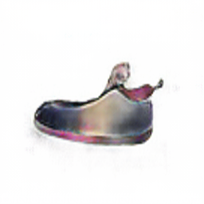
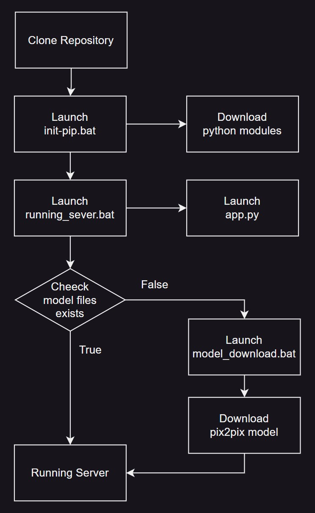

# Team Introduction
  ## team member’s names, IDs, and roles
  > 정호균
  - StudentID : 202211375
  - Role : Team Leader | Coder
  > 조익성
  - StudentID : 202011375
  - Role : Coder
  > 김형언
  - StudentID : 202211290
  - Role : Coder
  > 강조은
  - StudentID : 202211250
  - Role : Coder

# Topic Introduction
> __Edges to Photo__
- pytorch의 pix2pix모델을 사용하여 선화로 이루어진 신발 이미지를 실제 신발 이미지로 변환한다.
- 사용자가 그림을 그린 직후 바로 실사화해 결과를 보여주는 어플리케이션 제작을 목표로 한다.
> 프로젝트 결과 분석
- 사용자가 선화로 따라 그린 실제 그림과의 색과 형태 면에서 얼마나 차이나는가
- 유의미한 실사화가 일어나려면 어느 정도 수준의 선화를 제공해야하는가 (단순 아웃라인 부터 세부 묘사까지 테스트)

> Code Source
- [Project Repository](https://github.com/junyanz/pytorch-CycleGAN-and-pix2pix)
- [Information](https://phillipi.github.io/pix2pix/)
- [Example](https://phillipi.github.io/pix2pix/images/sketch2photo_shoes/latest_net_G_sketch/index.html)

# Results
>Input
- 
>Output
- 

# Analysis/Visualization

# Installation
## Overview


아래 모든 과정은 pix2pix.ipynb에서 진행하실 수 있습니다.
## 1.Environment
> os : window 10 / 11

> python : 3.9

> modules : defined at ```./pytorch-CycleGAN-and-pix2pix-master/requirements.txt```

목표 디렉토리내에서 아래 커맨드를 실행합니다.
```
git clone https://github.com/jungcyb/opensw23-eleven.git
cd opensw23-eleven
```

## 2.Module Installation
run the following command

아래 명령어를 cmd에서 실행합니다.
```
pip install torch torchvision torchaudio --index-url https://download.pytorch.org/whl/cu118

pip install -r pytorch-CycleGAN-and-pix2pix-master/requirements.txt
```

## 3.Pretrained Model download
```python
import os
path = os.getcwd()
os.system(f'start model_download.bat {path}')
```
위 코드를 실행시 자동으로 미리 훈련된 모델을 다운 받아 적절한 위치에 저장합니다.

## 4.Directory Setting
```python
import os
os.chdir("pytorch-CycleGAN-and-pix2pix-master")
```
위 코드를 실행해 파이썬의 실행 위치를 옮깁니다.

## 5.Testing
```
cd (프로젝트 경로)

python test.py --dataroot datasets/elevenTest --model test --netG unet_256 --direction BtoA --dataset_mode single --norm batch --name edges2shoes_pretrained --gpu_ids -1
```
위의 명령어를 cmd에서 실행해 

> "./pytorch-CycleGAN-and-pix2pix-master/datasets/elevenTest/test"

경로에 위치하는 선화 이미지들을 실사화합니다. 

변환된 이미지들은 
> "./pytorch-CycleGAN-and-pix2pix-master/results/edges2shoes_pretrained/test_latest/images"

폴더 내에 저장됩니다.


GPU가 CUDA코어를 지원한다면
```
python test.py --dataroot datasets/elevenTest --model test --netG unet_256 --direction BtoA --dataset_mode single --norm batch --name edges2shoes_pretrained
``` 
위 명령어로 빠른 시간 내에 결과를 얻어 볼 수도 있습니다.

## Result
```python
import matplotlib.pyplot as plt

img = plt.imread('./results/edges2shoes_pretrained/test_latest/images/test_fake.png')
plt.imshow(img)
```
pyplot을 이용해 저장된 결과물을 확인해볼 수 있습니다. 위 코드는 "test.jpg"의 실사화 결과를 보여줍니다. 파일명을 "test2_fake.png"로 바꿈으로서 "test2.jpg"의 결과 역시 볼 수 있습니다.
# Presentation
