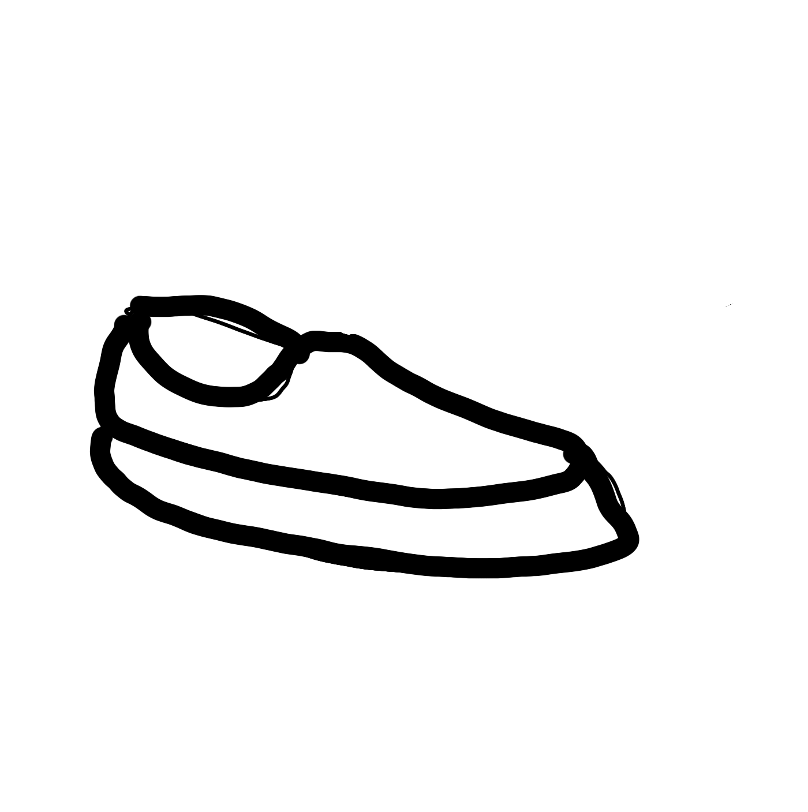

## 분석 기준

## 1. 배경색
 배경색 `"cyan"`과 `"yellow"`의 경우 결과물에 있어 큰 차이가 없을 뿐 아니라

> 배경색 `"cyan"` input
>

> 배경색 `"cyan"` output

> 배경색 `"yellow"` input
>

> 배경색 `"yellow"` output

두 색을 혼합해 배경을 구성하더라도 유의미한 차이가 나타나지 않았다.

> 배경색 `"cyan and yellow"` input
>

> 배경색 `"cyan"` output

반면 `"cyan"`과 `"red"`를 혼합해 배경을 구성했을 경우 실사를 구성하는 색의 체도가 낮아진 것을 확인할 수 있었는데 이를 토대로 모델은 "배경색"의 `"체도"`에 영향을 받으나 `"색조"`에는 큰 영향을 받지 않는 것으로 보인다.

## 2. 선 색
선화를 구성한는 선의 색상 역시 배경색과 비슷한 양상을 보였다.

`"cyan"`색,`"purple"`색, `"yellow"`색으로 그린 선화들은 실사의 색상이 모두 베이지 색으로 서로 큰 차이 없이 나왔으나,
> 선색 `"cyan"` input
>

> 선색 `"cyan"` output

> 선색 `"yellow"` input
>

> 선색 `"yellow"` output

> 선색 `"purple"` input
>

> 선색 `"purple"` output

`"black"`색상으로 구성한 선화 만큼은 채도가 낮아지고, `"붉은 색"` 실사로 나타나는 모습을 보였다.

> 선색 `"black"` input
>

> 선색 `"black"` output

배경색뿐 아니라 모든 색에 대해 모델의 구분 기준은 채도로 유추된다.

또한 `배경색과 선색의 채도가 비슷할 수록`, 즉 채도가 높을 수록 `실사의 형태가 뭉개지는` 모습을 보인다. 이는 앞서 말한 듯 채도의 차이로 색을 구별하는 과정에서 `외곽 인식`에 문제가 생긴 것으로 보인다.

## 3. 각도 및 디테일

아래 3가지 각도에 대한 output을 보자.

> 각도 `"0"` input
>

> 각도 `"0"` output

> 각도 `"45"` input
>

> 각도 `"45"` output

> 각도 `"-45"` input
>

> 각도 `"-45"` output

각도 45도에 대한 결과가 없던 신발끈의 디테일을 생성하는 등 가장 좋은 결과가 나왔다.

> 각도 `"45 - reflected"` input
>

> 각도 `"45 - reflected"` output

이는 이미지를 반전 시켰을 때도 같은 결과가 나왔는데 이를 토대로 `신발 앞코는 바닥을`, 발을 집어넣는 `목 부분이 위를` 향할 수록 더 좋은 결과가 나오는 것을 알 수 있었다.

다만 선화의 디테일이 더 들어갔을 떄는 조금 다른 양상을 보였다.

> 각도 `"180"` input
>

> 각도 `"180"` output

> 각도 `"-45"` input
>

> 각도 `"-45"` output

> 각도 `"-45 - reflected"` input
>

> 각도 `"-45 - reflected"` output

각도 180과 각도 -45 중 180의 쪽이 `신발 밑창과 가죽의 경계 분할면`에서 더 나은 구분을 보인다. 이는 `선화의 각도보다 신발끈 등의 디테일`이 더 우선적으로 반영된다는 것으로 해석 될 수 있을 것 같다.

## 4. 선 두께

`"normal"`정도의 선 두께와 `"thick"`정도의 선 두께를 비교했을 때 확연히 `"normal"`쪽의 결과가 더 좋은 것을 볼 수 있다.

> 두께 `"normal"` input
> 

> 두께 `"normal"` output
> 

> 두께 `"thick"` input
> 

> 두께 `"thick"` output
> 

신발의 내 외부 경계가 `"thick"`에서 모호한 것을 보면 `선의 두께가 두꺼울 수록 경계 구분에 어려워하는 것으로 보인다.`

## 5. 두 물체의 우선순위

> `case1` input
> 

> `case1` output
> 

> `case2` input
> 

> `case2` output
> 

입력이미지에 두 선화가 존재할 경우 어떻게 되는지 비교해보았다. `case1`과 `case2`를 비교해보면 두 경우 모두 `얇은 선에 비해 두꺼운 선이 중점적으로 실사화`가 되었으나 모두 품질이 떨어지는 모습을 보인다. 이는 얇은 선의 왼쪽 선화가 영향을 미친 것으로 보이며 `case1`쪽이 더 노이즈가 큰 것을 보아 `두 물체 사이의 두께 차이가 적을 수록 노이즈가 큰 것으로 보인다.` 

## 6. 선화의 크기

> `big` input
> 

> `big` output
> 

> `small` input
> 

> `small` output
> 

`선화의 크기가 작을 수록 품질이 확연히 떨어지는` 모습을 확인할 수 있다.

## 7. 이미지의 크기

> `512` input
> 

> `512` output
> 

> `256` input
> 

> `256` output
> 

`입력 이미지 파일의 크기는 영향이 적은 것으로 보인다.` 이는 모델 내부 적으로 resize과정을 거치는 것으로 유추된다.

## 8. 선화의 위치

선화를 `가운데를 포함, 팔방`으로 옯겨가며 모델을 돌려본 결과 흥미로운 결과가 있었다. 아래 3가지 경우를 보면

> `bottom_middle` input
> 

> `bottom_middle` output
> 

> `middle` input
> 

> `middle` output
> 

> `top_middle` input
> 

> `top_middle` output
> 

`선화가 바닥에 가까울 수록 더 좋은 결과를 보이는 것을 알 수 있다.`

이는 좌우로 옮기더라도 동일한 양상을 보였다.

> `bottom_left` input
> 

> `bottom_left` output
> 

> `left` input
> 

> `left` output
> 

> `top_left` input
> 

> `top_left` output
> 

## 분석 결론
분석 결과 모델의 실사화 성능은 다음과 같은 요소에 영향을 받는 것으로 보인다.

1. 선의 두께 (얇을 수록 Good)
2. 선의 채도 (배경과 차이가 클 수록 Good)
3. 배경의 채도 (선과 차이가 클 수록 Good)
4. 선화의 위치 (바닥에 붙어 있을 수록 Good)
5. 선화의 디테일 (신발 끈 등 특징적인 디테일이 뚜렷할 수록 Good)
6. 선화의 각도 (사선으로 기울어져 있으며 신발코가 바닥을 향하는 것이 Good)